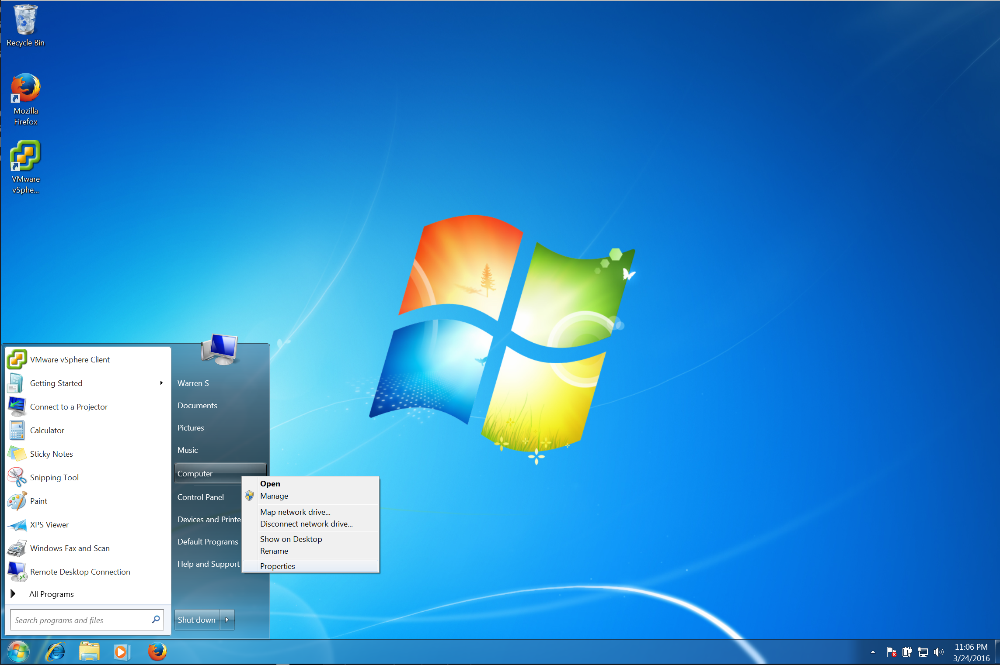
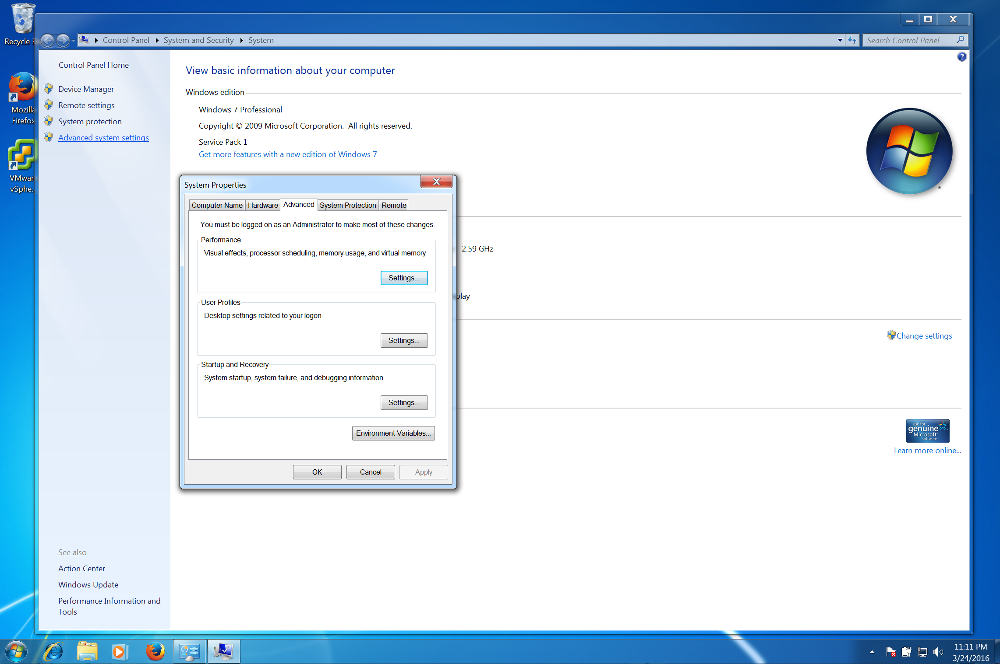
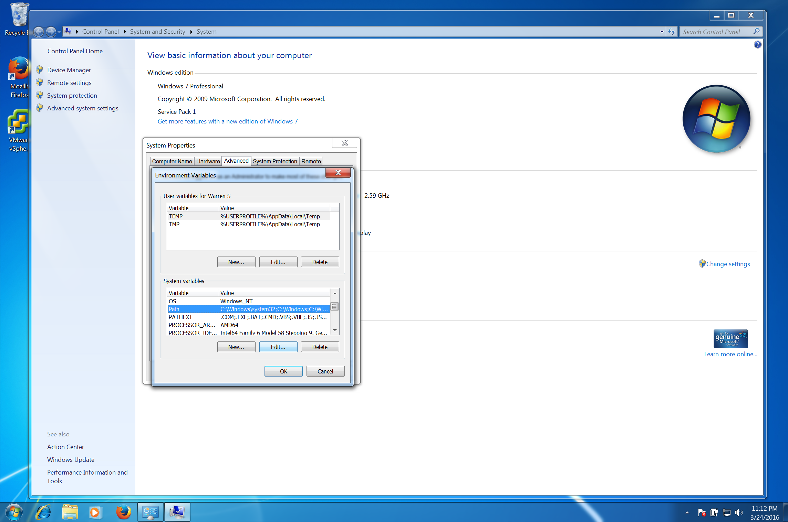

# Basic Functionality Amazon Clone
Full Stack Application Engineering Project

## The 3-step guide to building and running the code
1. Install maven (see the steps below)
2. Run `git clone https://github.com/TroyStopera/prime-project.git` or `git pull origin master` to get the latest version of the repo
3. Run `mvn` to build the code and package it into a jar
4. Run `mvn exec:java` to run the project
5. Open `http://localhost:8080/` in a web browser.

## Installing maven
### On Mac OSX with Homebrew
1. `brew install maven`

### On Mac OSX without Homebrew
1. Download the Maven .zip archive [here](http://download.nextag.com/apache/maven/maven-3/3.3.9/binaries/apache-maven-3.3.9-bin.zip).
2. Extract the archive. I'll assume that you extracted it to `~/maven`.
3. Add the following line to your `.bash_profile`: `export PATH=${PATH}:~/maven/bin`.

### On Windows
1. Download the Maven .zip archive [here](http://download.nextag.com/apache/maven/maven-3/3.3.9/binaries/apache-maven-3.3.9-bin.zip).
2. Extract the archive. I'll assume that you extracted it to `C:\maven`.
3. Add `C:\maven\bin` to your `PATH` environment variable:
  1. Click on the Start button > Right click on `Computer` > Click on `Properties` .
  2. Click on `Advanced System Settings`. In the popup window that appears, select the `Advanced` tab > Click on `Environment Variables`. .
  3. Find the variable named `Path` under `System variables` and click the `Edit` button. .
  4. Add `;C:\maven\bin` to the end of the value, then click `OK`.

## Directory structure
- `<project-root>` - run `mvn package exec:java` to compile and run the webserver
	- `src` - code goes in here
		- `main`
			- `java` - Java code goes in here
			- `resources` - files needed by the webserver that aren't code go in here
				- `debug/db.html` - the HTML page for the DB query tester
				- `static` - any files put in here are served from `http://localhost:8080/static/`. So file named `jquery.js` will be accessible from `http://localhost:8080/static/jquery.js`.
		- `test/java` - Java unit tests go in here
	- `docs` - documentation goes in here
	- `target` - maven puts compiled code and jars in here
